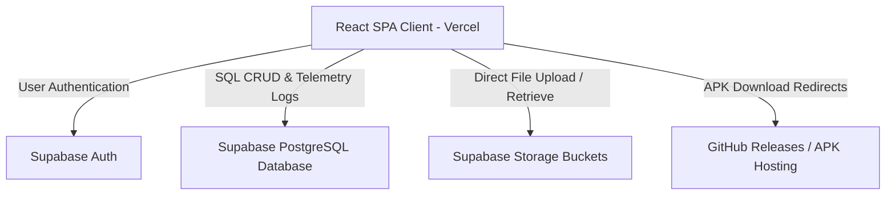

# GoTop Technologies - Technical Reference Manual & Developer README

Welcome to the official developer and AI system maintenance manual for **GoTop Technologies**. This document serves as the comprehensive source of truth for the project's codebase, architecture, database schema, storage infrastructure, authentication policies, deployment configuration, and operational workflows.

---

## PROJECT OVERVIEW

### Project Name
* **GoTop Technologies**

### Purpose
GoTop Technologies is a world-class technology company web portal and administration platform. It serves as a unified catalog for distributing, showcasing, and updating the company's software applications (specifically Android APK files), while providing a centralized administrative dashboard to manage content, settings, system announcements, and download telemetry.

### Target Users
1. **End-Users / Consumers:** Individuals looking to discover, review, and download verified, high-performance applications (games, utility clients, photography tools) directly as APK packages.
2. **Super Administrators:** GoTop team members who log in to the protected console to publish new apps, edit metadata, upload visual assets, issue announcements, check traffic analytics, and customize site-wide branding properties.

### Core Business Logic
* **Dynamic Content Cataloging:** Applications are organized by categories and detailed with specifications (size, version, rating, screenshots, features list, and interactive changelogs).
* **Direct Asset Management:** Logos and screenshots are uploaded directly from the browser to Supabase storage.
* **External APK Distribution:** APK packages are hosted securely on GitHub Releases (or custom URLs) and managed dynamically via download redirect paths.
* **Telemetry & Analytics logging:** Every page visit and APK download is logged client-side to track popularity, traffic trends, and aggregate download meters.
* **Dynamic Site Branding & Editing:** Global text strings (company name, taglines, footers, contacts), social links, and About Us content (journey description, leadership team profiles, and company roadmaps) are stored in the database, allowing live updates without rebuilding the frontend.

### High-Level Architecture
The project employs a modern, serverless **SPA (Single Page Application)** architecture built with **React** and **Vite**, deployed on **Vercel**. It connects the client application directly to **Supabase** backend services via the Supabase Javascript Client SDK.



---

## TECHNOLOGY STACK

The platform utilizes a modern serverless stack optimized for high performance, visual quality, and rapid content publishing:

| Layer / Service | Technology Used | Version / Description |
| :--- | :--- | :--- |
| **Frontend Framework** | React | `^18.3.1` (Single Page Application) |
| **Build & Tooling** | Vite | `^5.2.11` (Ultra-fast development server & bundler) |
| **Routing System** | React Router DOM | `^6.23.1` (Declarative client-side routing) |
| **Database** | PostgreSQL | Hosted on **Supabase** |
| **Authentication** | Supabase Auth | JWT-based user session handling |
| **Storage Engine** | Supabase Storage | S3-compatible cloud bucket storage |
| **State Management** | React Context API | Local providers for Authentication and Site Settings |
| **Styling System** | Tailwind CSS | `^3.4.3` with utility class base |
| **CSS Processors** | PostCSS, Autoprefixer | For production browser compatibility |
| **Animation Engine** | Framer Motion | `^11.2.10` (Smooth interactive micro-animations) |
| **Utility Icons** | Lucide React | `^0.381.0` (Inline vector icon rendering) |
| **Deployment Platform** | Vercel | Production static hosting with edge routing |
| **Hosting (External assets)**| GitHub Releases | Hosting APK binary files externally |

---

## PROJECT STRUCTURE

```
MyWeb/
├── .gitignore                   # Excludes node_modules, build directories, and env secrets
├── README.md                    # System technical reference manual (this file)
├── run-project.bat              # Batch control center dashboard for local operations
└── frontend/                    # Vite client workspace
    ├── postcss.config.js        # PostCSS configuration
    ├── tailwind.config.js       # Core Tailwind CSS design system tokens
    ├── vercel.json              # Vercel configuration for SPA router rewrite rules
    ├── vite.config.js           # Vite configuration & dev server parameters
    ├── package.json             # Package configuration & dependencies
    ├── index.html               # SPA Entry Template (loads Plus Jakarta Sans & Manrope fonts)
    ├── .env                     # Local environment credentials (secret)
    ├── .env.example             # Template for setup instructions
    ├── public/                  # Static assets copied directly to build root
    │   ├── icon.png             # Site favicon / custom GoTop GT icon
    │   ├── logo.png             # Full GoTop horizontal wordmark
    │   └── mockup.jpg           # Premium social preview dashboard graphic
    └── src/                     # React Application source code
        ├── main.jsx             # React DOM mounting and Context provider wrapping
        ├── App.jsx              # Central router mapping public vs admin views (with scroll-to-top handler)
        ├── index.css            # Custom CSS animations, ambient glows, and glassmorphism classes
        ├── config/
        │   └── supabase.js      # Supabase Client SDK initialization & export
        ├── context/
        │   ├── AuthContext.jsx      # Admin session listener, Login & Logout helpers
        │   └── SettingsContext.jsx  # Company branding & About page settings sync (with Nexvora auto-migration)
        ├── utils/
        │   └── supabaseSeeder.js    # Database seeder for categories, apps, announcements, & analytics
        ├── components/
        │   ├── Navbar.jsx       # Brand header navbar with sliding transitions & responsive mobile toggles
        │   ├── Footer.jsx       # Global footer, company information, and social links
        │   └── ParticleBg.jsx   # HTML5 Canvas floating orange/navy particle animation
        ├── pages/
        │   ├── Home.jsx         # Hero showcase, trending grid, and recent updates
        │   ├── About.jsx        # Company history, mission, leadership, and roadmap
        │   ├── Services.jsx     # Modern design & engineering service catalog
        │   ├── Apps.jsx         # App grid catalog with search and category tabs
        │   ├── AppDetails.jsx   # Details, screenshots carousel, features, and download triggers
        │   ├── Downloads.jsx    # Quick download list and version history release logs
        │   ├── Announcements.jsx# Public bulletin feed for news and maintenance alerts
        │   └── Contact.jsx      # Validation support form logging tickets to database
        └── admin/
            ├── AdminLayout.jsx          # Auth guard layer, dashboard sidebar, and console shell
            ├── Login.jsx                # Secure login form with state verification
            ├── Dashboard.jsx            # Console metrics, SVG activity charts, and seeding controls
            ├── ManageApps.jsx           # App catalog CRUD with storage file upload handlers
            ├── ManageCategories.jsx     # Category structure administrator panel
            ├── ManageAnnouncements.jsx  # System-wide announcement CRUD console
            ├── ManageSettings.jsx       # Global branding & contacts editor
            └── ManageAbout.jsx          # About page journey, team members list, and roadmap editor
```

---

## UI / UX SYSTEM

The user interface utilizes a premium, clean, light-themed SaaS design system inspired by Stripe, Linear, OpenAI, and Vercel.

### Design Language
- **Frosted Card Panels:** UI cards and containers use a semi-transparent light background (`rgba(255, 255, 255, 0.75)`), backdrop blur filters, and thin slate borders with soft opacity.
- **Ambient Glow Accents:** Visual elements employ soft box shadows and gradients using warm orange (`#F97316`) and deep navy (`#0F172A`) radial highlights.
- **Micro-Interactive Hover Effects:** Buttons and active links scale gently (`hover:scale-[1.02] active:scale-[0.98]`), navigation links feature custom underbar slide transitions, and table list rows transition seamlessly on mouse hover.
- **Scroll Resetter:** Implemented a page scroll reset handler inside the core router. Navigating between paths automatically scroll-aligns the window viewport back to the top.

### Color Palette
Tailwind custom extensions configured in `tailwind.config.js`:
- `space-darkest`: `#F8FAFC` (Off-white body background)
- `space-darker`: `#FFFFFF` (White panels, sidebar, and headers background)
- `space-dark`: `#F1F5F9` (Secondary container/input background)
- `space-card`: `rgba(255, 255, 255, 0.7)` (Frosted overlay panels)
- `space-border`: `rgba(15, 23, 42, 0.08)` (Light slate borders)
- `neon-blue`: `#F97316` (Brand Orange accent and primary buttons)
- `neon-indigo`: `#0F172A` (Deep Navy structural weights)
- `neon-accent`: `#1E293B` (System slate Highlights)

### Typography
- **Headings (`h1`, `h2`, `h3`, `h4`, `h5`, `h6`):** **Plus Jakarta Sans** (Display typeface with clean, geometric modern lines).
- **Body & UI Controls:** **Manrope** (Highly legible sans-serif optimized for information structures and descriptions).

---

## DATABASE ARCHITECTURE

### Database Provider
* **Supabase PostgreSQL** (Relational Database)

### Tables & Columns Reference

#### 1. `settings`
Stores site-wide variables, branding assets, and dynamic About Us page content.
* `id` (text, PRIMARY KEY, Default: `'global'`): System singleton identifier.
* `company_name` (text): The main company name (e.g., `'GoTop Technologies'`).
* `tagline` (text): Company marketing tagline (e.g., `'Technology That Takes You to the Top'`).
* `logo_url` (text): Absolute or relative URL to the company logo image.
* `favicon_url` (text): Absolute or relative URL to the browser favicon icon.
* `theme` (text, Default: `'light'`): Interface theme styling flag.
* `footer_text` (text): Declared copyright or footer labels.
* `contact_email` (text): General customer support email.
* `contact_phone` (text): Contact phone number.
* `address` (text): Office physical location address.
* `social_links` (jsonb): JSON object holding social media endpoints (e.g. `{facebook: "", github: ""}`).
* `about_journey_heading` (text): Heading for the history section on the About page.
* `about_journey_p1` (text): First paragraph of the company history.
* `about_journey_p2` (text): Second paragraph of the company history.
* `about_journey_quote` (text): Callout quote on the About page.
* `about_journey_img` (text): Image URL displaying the workspace or team.
* `about_mission_text` (text): Text defining the company's mission statement.
* `about_vision_text` (text): Text defining the company's vision statement.
* `about_leadership` (jsonb): JSON array of objects representing company leadership team members:
  ```json
  [{"name": "Name", "role": "Title", "img": "ImageURL"}]
  ```
* `about_roadmaps_desc` (text): Description text preceding the roadmap timeline.
* `about_roadmaps` (jsonb): JSON array of objects representing milestones:
  ```json
  [{"year": "Q4 2026", "title": "Milestone Title", "desc": "Milestone details"}]
  ```

#### 2. `categories`
Organizes applications in the catalog.
* `id` (uuid, PRIMARY KEY, Default: `gen_random_uuid()`): Unique identifier.
* `name` (text, UNIQUE): The category display name (e.g. `'Games'`, `'Tools'`).
* `icon` (text, Default: `'Folder'`): Corresponding Lucide icon identifier.
* `description` (text): Detailed category summary.
* `created_at` (timestamptz): Timestamp when the category was created.

#### 3. `apps`
Holds the core application catalog metadata.
* `id` (uuid, PRIMARY KEY, Default: `gen_random_uuid()`): Unique identifier.
* `app_name` (text): Display name of the application.
* `slug` (text, UNIQUE): URL-friendly string format (e.g., `'video-saver'`).
* `description` (text): Full descriptive text.
* `short_description` (text): One-liner summary for listings.
* `category_id` (uuid, REFERENCES `categories.id` ON DELETE SET NULL): Relationship to the parent category.
* `version` (text): Current software release version (e.g., `'2.1.0'`).
* `size` (text, Default: `'15 MB'`): File footprint details.
* `rating` (numeric, Default: `5.0`): User review rating out of 5.0.
* `logo_url` (text): URL to the application logo graphic.
* `apk_download_url` (text): Public endpoint to download the APK file.
* `release_notes` (text): Summary of modifications in the latest version.
* `featured` (boolean, Default: `false`): Flag to highlight the app in hero sliders.
* `trending` (boolean, Default: `false`): Flag to highlight the app in popular sections.
* `download_count` (integer, Default: `0`): Aggregated total downloads.
* `features` (jsonb, Default: `[]`): Array of strings highlighting app features.
* `screenshots` (jsonb, Default: `[]`): Array of screenshot image URLs.
* `changelog` (jsonb, Default: `[]`): Array of objects representing previous releases:
  ```json
  [{"version": "2.1.0", "date": "June 02, 2026", "notes": "Release notes..."}]
  ```
* `active` (boolean, Default: `true`): Visibility control toggle.
* `created_at` (timestamptz)
* `updated_at` (timestamptz)

#### 4. `announcements`
Stores public updates, news bulletins, and schedule alerts.
* `id` (uuid, PRIMARY KEY)
* `title` (text): Bulletin title.
* `content` (text): Full body text.
* `type` (text, Default: `'News'`): Category of announcement (e.g. `'Launch'`, `'Maintenance'`, `'News'`).
* `active` (boolean, Default: `true`): Controls public visibility.
* `created_at` (timestamptz)

#### 5. `admins`
Stores additional metadata for authenticated administrative accounts.
* `id` (uuid, PRIMARY KEY)
* `name` (text): Full name.
* `email` (text, UNIQUE): Authentication email matches.
* `role` (text, Default: `'admin'`): Access level.
* `created_at` (timestamptz)

#### 6. `contact_tickets`
Logs customer inquiries and feedback forms.
* `id` (uuid, PRIMARY KEY)
* `name` (text): User's name.
* `email` (text): User's email.
* `subject` (text): Summary topic.
* `message` (text): Detailed inquiry text.
* `status` (text, Default: `'open'`): Ticket state tracking (e.g. `'open'`, `'resolved'`).
* `created_at` (timestamptz)

#### 7. `analytics_logs`
Logs telemetry events to measure download analytics and page visits.
* `id` (uuid, PRIMARY KEY)
* `event_type` (text): Event classifications: `'visit'` (home load) or `'download'` (download trigger).
* `ip` (text): Client IP address (captured client-side).
* `user_agent` (text): Web browser header details.

---

## AUTHENTICATION SYSTEM

### Authentication Engine
* **Supabase Auth** (JSON Web Token based authentication)

### Login Flow
```
[Admin inputs credentials] 
   └── [supabase.auth.signInWithPassword(email, password)]
         ├── Success: Session JWT stored in LocalStorage -> Redirect to Dashboard
         └── Failure: Display error string to admin
```

---

## API DOCUMENTATION

Since this is a serverless application, the React client interacts directly with Supabase via the client SDK.

### 1. Authentication Operations

#### Sign In
```javascript
const { data, error } = await supabase.auth.signInWithPassword({
  email: 'admin@gotoptech.com',
  password: 'secure_password'
});
```

#### Sign Out
```javascript
const { error } = await supabase.auth.signOut();
```

---

## ENVIRONMENT VARIABLES

Vite requires environment variables to be prefixed with `VITE_` to expose them to client-side code.

| Variable Name | Purpose | Required Format |
| :--- | :--- | :--- |
| **`VITE_SUPABASE_URL`** | The API endpoint of your Supabase project. | `https://[project-ref-id].supabase.co` |
| **`VITE_SUPABASE_ANON_KEY`** | The anonymous API key for public queries. | Standard Supabase anon JWT string |

---

## DEPLOYMENT GUIDE

### Local Development Setup
1. **Clone the Repository:**
   ```bash
   git clone https://github.com/rathoredeepak21/GoTop-Technologies.git
   cd GoTop-Technologies
   ```
2. **Install Dependencies:**
   ```bash
   cd frontend
   npm install
   ```
3. **Configure Local Environment:**
   Create a `.env` file in the `frontend/` directory with your Supabase credentials:
   ```env
   VITE_SUPABASE_URL=https://jnvmovvcjclnykycggtf.supabase.co
   VITE_SUPABASE_ANON_KEY=your_supabase_anon_key
   ```
4. **Run the Project:**
   Execute the interactive control batch script:
   ```bash
   cd ..
   ./run-project.bat
   ```
   Select option `[2]` to start the Vite development server. Alternatively, run:
   ```bash
   cd frontend
   npm run dev
   ```
5. **Access the Site:**
   Open your browser and navigate to `http://localhost:3000`.
