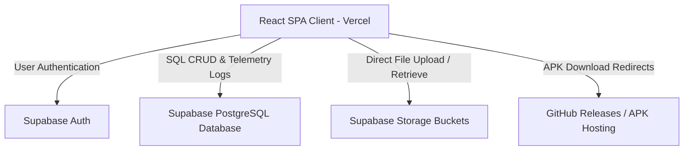
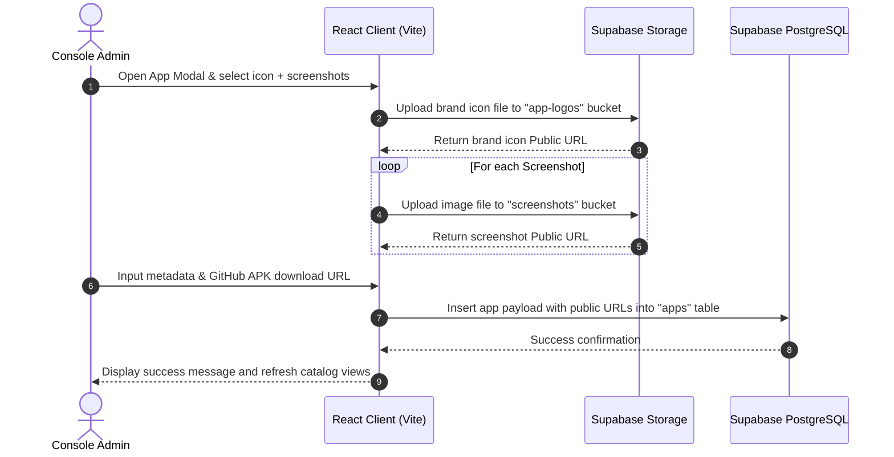
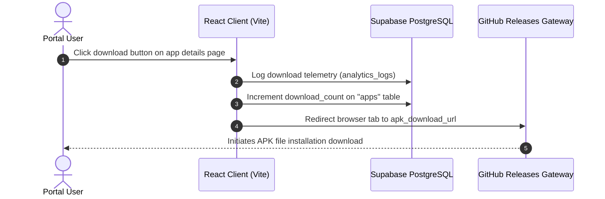

# NEXVORA TECHNOLOGIES - Technical Reference Manual & Developer README

Welcome to the official developer and AI system maintenance manual for **NEXVORA TECHNOLOGIES**. This document serves as the comprehensive source of truth for the project's codebase, architecture, database schema, storage infrastructure, authentication policies, deployment configuration, and operational workflows.

---

## PROJECT OVERVIEW

### Project Name
* **NEXVORA TECHNOLOGIES**

### Purpose
NEXVORA TECHNOLOGIES is a world-class technology company web portal and administration platform. It serves as a unified catalog for distributing, showcasing, and updating the company's software applications (specifically Android APK files), while providing a centralized administrative dashboard to manage content, settings, system announcements, and download telemetry.

### Target Users
1. **End-Users / Consumers:** Individuals looking to discover, review, and download verified, high-performance applications (games, utility clients, photography tools) directly as APK packages.
2. **Super Administrators:** Nexvora team members who log in to the protected console to publish new apps, edit metadata, upload visual assets, issue announcements, check traffic analytics, and customize site-wide branding properties.

### Core Business Logic
* **Dynamic Content Cataloging:** Applications are organized by categories and detailed with specifications (size, version, rating, screenshots, features list, and interactive changelogs).
* **Direct Asset Management:** Logos and screenshots are uploaded directly from the browser to Supabase storage.
* **External APK Distribution:** APK packages are hosted securely on GitHub Releases (or custom URLs) and managed dynamically via download redirect paths.
* **Telemetry & Analytics logging:** Every page visit and APK download is logged client-side to track popularity, traffic trends, and aggregate download meters.
* **Dynamic Site Branding & Editing:** Global text strings (company name, taglines, footers, contacts), social links, and About Us content (journey description, leadership team profiles, and company roadmaps) are stored in the database, allowing live updates without rebuilding the frontend.

### High-Level Architecture
The project employs a modern, serverless **SPA (Single Page Application)** architecture built with **React** and **Vite**, deployed on **Vercel**. It eliminates traditional mid-tier APIs by connecting the client application directly to **Supabase** backend services via the Supabase Javascript Client SDK.



---

## TECHNOLOGY STACK

The platform utilizes a modern serverless stack optimized for high performance, visual quality, and rapid content publishing:

| Layer / Service | Technology Used | Version / Description |
| :--- | :--- | :--- |
| **Frontend Framework** | React | `^18.3.1` (Single Page Application) |
| **Build & Tooling** | Vite | `^5.2.11` (Ultra-fast development server & bundler) |
| **Routing System** | React Router DOM | `^6.23.1` (Declarative client-side routing) |
| **Database** | PostgreSQL | Hosted on **Supabase** |
| **Authentication** | Supabase Auth | JWT-based user session handling |
| **Storage Engine** | Supabase Storage | S3-compatible cloud bucket storage |
| **State Management** | React Context API | Local providers for Authentication and Site Settings |
| **Styling System** | Tailwind CSS | `^3.4.3` with utility class base |
| **CSS Processors** | PostCSS, Autoprefixer | For production browser compatibility |
| **Animation Engine** | Framer Motion | `^11.2.10` (Smooth interactive micro-animations) |
| **Utility Icons** | Lucide React | `^0.381.0` (Futuristic inline vector icon rendering) |
| **Deployment Platform** | Vercel | Production static hosting with edge routing |
| **Hosting (External assets)**| GitHub Releases | Hosting APK binary files externally |

---

## PROJECT STRUCTURE

```
MyWeb/
├── .gitignore                   # Excludes node_modules, build directories, and env secrets
├── README.md                    # System technical reference manual (this file)
├── run-project.bat              # Batch control center dashboard for local operations
└── frontend/                    # Vite client workspace
    ├── postcss.config.js        # PostCSS configuration
    ├── tailwind.config.js       # Core Tailwind CSS design system tokens
    ├── vercel.json              # Vercel configuration for SPA router rewrite rules
    ├── vite.config.js           # Vite configuration & dev server parameters
    ├── package.json             # Package configuration & module dependencies
    ├── index.html               # SPA Entry Template (loads Poppins & Inter fonts)
    ├── .env                     # Local environment credentials (secret)
    ├── .env.example             # Template for setup instructions
    ├── public/                  # Static assets copied directly to build root
    │   ├── icon.png             # Site favicon / custom cyan N logo icon
    │   └── logo.png             # Full Nexvora horizontal logo
    └── src/                     # React Application source code
        ├── main.jsx             # React DOM mounting and Context provider wrapping
        ├── App.jsx              # Central router outlet mapping public vs admin views
        ├── index.css            # Custom CSS animations, neon text glows, and glassmorphism classes
        ├── config/
        │   └── supabase.js      # Supabase Client SDK initialization & export
        ├── context/
        │   ├── AuthContext.jsx      # Admin session listener, Login & Logout helpers
        │   └── SettingsContext.jsx  # Company branding & About page settings sync
        ├── utils/
        │   └── supabaseSeeder.js    # Database seeder for categories, apps, announcements, & analytics
        ├── components/
        │   ├── Navbar.jsx       # Brand header navbar with responsive mobile toggles
        │   ├── Footer.jsx       # Global footer, company information, and social links
        │   └── ParticleBg.jsx   # HTML5 Canvas custom floating vector particle animation
        ├── pages/
        │   ├── Home.jsx         # Hero showcase, trending grid, and recent updates
        │   ├── About.jsx        # Company history, mission, leadership, and roadmap
        │   ├── Services.jsx     # Modern design & engineering service catalog
        │   ├── Apps.jsx         # App grid catalog with search and category tabs
        │   ├── AppDetails.jsx   # Details, screenshots carousel, features, and download triggers
        │   ├── Downloads.jsx    # Quick download list and version history release logs
        │   ├── Announcements.jsx# Public bulletin feed for news and maintenance alerts
        │   └── Contact.jsx      # Validation support form logging tickets to database
        └── admin/
            ├── AdminLayout.jsx          # Auth guard layer, dashboard sidebar, and console shell
            ├── Login.jsx                # Secure login form with state verification
            ├── Dashboard.jsx            # Console metrics, SVG activity charts, and seeding controls
            ├── ManageApps.jsx           # App catalog CRUD with storage file upload handlers
            ├── ManageCategories.jsx     # Category structure administrator panel
            ├── ManageAnnouncements.jsx  # System-wide announcement CRUD console
            ├── ManageSettings.jsx       # Global branding & contacts editor
            └── ManageAbout.jsx          # About page journey, team members list, and roadmap editor
```

### Module Dependencies
1. **Supabase Provider Layer (`src/config/supabase.js`):** The foundation of data access. Used by `AuthContext`, `SettingsContext`, all admin management pages, and public page analytics hooks.
2. **Context Provider Layer (`src/context/`):**
   - `AuthProvider` wraps the entire app, providing `admin` session state to `AdminLayout` and `Login`.
   - `SettingsProvider` fetches branding parameters on app load, exposing properties (company name, logo, social links) to `Navbar`, `Footer`, `Login`, `Home`, and all public subpages.
3. **Admin Panel Shell (`src/admin/AdminLayout.jsx`):** Serves as a gatekeeper. If the authenticated session is missing, it cancels rendering and redirects the user to `/admin/login`.

---

## FRONTEND ARCHITECTURE

The application operates as a Single Page Application (SPA) driven by client-side routing.

### Routing System
Managed in `src/App.jsx` using `react-router-dom`:
* **Public Outlets:** Accessible by everyone. Features a canvas-based floating particle background (`ParticleBg`), global `Navbar`, and global `Footer`.
* **Admin Auth Route (`/admin/login`):** A clean entry point with ambient backgrounds, omitting navigation elements.
* **Console Outlets (`/admin/*`):** Nested inside the `AdminLayout` shell. It strips public headers, footers, and canvas overlays, replacing them with a dark admin navigation sidebar and super-admin workspace.

### Layout System
1. **Dynamic Layout Switching:** Determined in `App.jsx` by checking `location.pathname.startsWith('/admin') && location.pathname !== '/admin/login'`. If true, the system skips public navigation components and mounts the admin console layout.
2. **Admin Console Sidebar:** A responsive dashboard controller displaying navigation options, an online administrator status indicator, and a safe exit logout button.

### Component Hierarchy
```
[main.jsx]
   └── [BrowserRouter]
         └── [AuthProvider]
               └── [SettingsProvider]
                     └── [App.jsx] (Renders ParticleBg, Navbar, Footer conditionally)
                           ├── [Routes]
                           │     ├── Public Route: Home, About, Services, Apps, Downloads, Announcements, Contact
                           │     ├── Auth Route: Login
                           │     └── Guarded Admin Console Route: [AdminLayout]
                           │                                          └── Dashboard, ManageApps, ManageCategories, ManageAnnouncements, ManageSettings, ManageAbout
```

### Navigation Flow
* Users browse application cards on the `Home` page, the `Apps` search catalog, or the `Downloads` list.
* Clicking on any application triggers route changes to `/apps/details/:slug` to display features and versions.
* Attempting to enter `/admin/*` redirects to `/admin/login` unless a verified Supabase Auth JWT session is loaded in the browser.

---

## UI / UX SYSTEM

The user interface utilizes a premium, high-tech, futuristic design system inspired by glassmorphism, cyberpunk aesthetics, and space themes.

### Design Language
* **Glassmorphic Panels:** UI cards and consoles use a semi-transparent dark background (`rgba(13, 19, 33, 0.45)`), blur filter backdrops (`blur(14px)`), and thin cyan/blue borders with soft opacity.
* **Neon Glow Accents:** Visual elements employ text-shadows, box-shadows, and gradients using bright cyan and neon indigo to highlight call-to-actions, badges, and headers.
* **Floating Particles:** Public pages render dynamic, float-vector circular nodes on an HTML5 canvas (`ParticleBg`) that interactively float and drift.

### Color Palette
Tailwind custom extensions configured in `tailwind.config.js`:
* `space-darkest`: `#05070c` (Base body background)
* `space-darker`: `#080c14` (Sidebar and dashboard background)
* `space-dark`: `#0d1321` (Input boxes and card backgrounds)
* `space-card`: `rgba(13, 19, 33, 0.45)` (Glassmorphism panels)
* `space-border`: `rgba(59, 130, 246, 0.15)` (Accent borders)
* `neon-blue`: `#00d2ff` (Cyan branding and button states)
* `neon-indigo`: `#4f46e5` (Deep indigo secondary accents)
* `neon-accent`: `#3b82f6` (System blue highlights)

### Typography
* **Headings (`h1`, `h2`, `h3`, `h4`, `h5`, `h6`):** **Poppins** (Sans-serif display typeface with clean geometric lines).
* **Body & UI Controls:** **Inter** (Highly legible sans-serif optimized for code structures, numbers, and descriptive labels).

### Key UX Behaviors
1. **Hero Section Behavior:** Renders a high-tech tagline and a large cropped transparent aspect-ratio container with the brand's logo. Animated entry transitions are handled by Framer Motion.
2. **App Showcase Behavior:** Users can switch category tabs instantly without page reloads. Search inputs filter the active catalog card list in real-time.
3. **Interactive Download Flow:** Triggered from `AppDetails.jsx` or `Downloads.jsx`. Triggers a quick client-side telemetry insert into `analytics_logs` before redirecting the browser window to the APK installation path.

---

## DATABASE ARCHITECTURE

### Database Provider
* **Supabase PostgreSQL** (Relational Database)

### Tables & Columns Reference

#### 1. `settings`
Stores site-wide variables, branding assets, and dynamic About Us page content.
* `id` (text, PRIMARY KEY, Default: `'global'`): System singleton identifier.
* `company_name` (text): The main company name (e.g., `'NEXVORA TECHNOLOGIES'`).
* `tagline` (text): Company marketing tagline.
* `logo_url` (text): Absolute or relative URL to the company logo image.
* `favicon_url` (text): Absolute or relative URL to the browser favicon icon.
* `theme` (text, Default: `'dark'`): Interface theme styling flag.
* `footer_text` (text): Declared copyright or footer labels.
* `contact_email` (text): General customer support email.
* `contact_phone` (text): Contact phone number.
* `address` (text): Office physical location address.
* `social_links` (jsonb): JSON object holding social media endpoints (e.g. `{facebook: "", github: ""}`).
* `about_journey_heading` (text): Heading for the history section on the About page.
* `about_journey_p1` (text): First paragraph of the company history.
* `about_journey_p2` (text): Second paragraph of the company history.
* `about_journey_quote` (text): Callout quote on the About page.
* `about_journey_img` (text): Image URL displaying the workspace or team.
* `about_mission_text` (text): Text defining the company's mission statement.
* `about_vision_text` (text): Text defining the company's vision statement.
* `about_leadership` (jsonb): JSON array of objects representing company leadership team members:
  ```json
  [{"name": "Name", "role": "Title", "img": "ImageURL"}]
  ```
* `about_roadmaps_desc` (text): Description text preceding the roadmap timeline.
* `about_roadmaps` (jsonb): JSON array of objects representing milestones:
  ```json
  [{"year": "Q4 2026", "title": "Milestone Title", "desc": "Milestone details"}]
  ```

#### 2. `categories`
Organizes applications in the catalog.
* `id` (uuid, PRIMARY KEY, Default: `gen_random_uuid()`): Unique identifier.
* `name` (text, UNIQUE): The category display name (e.g. `'Games'`, `'Tools'`).
* `icon` (text, Default: `'Folder'`): Corresponding Lucide icon identifier.
* `description` (text): Detailed category summary.
* `created_at` (timestamptz): Timestamp when the category was created.

#### 3. `apps`
Holds the core application catalog metadata.
* `id` (uuid, PRIMARY KEY, Default: `gen_random_uuid()`): Unique identifier.
* `app_name` (text): Display name of the application.
* `slug` (text, UNIQUE): URL-friendly string format (e.g., `'video-saver'`).
* `description` (text): Full descriptive text.
* `short_description` (text): One-liner summary for listings.
* `category_id` (uuid, REFERENCES `categories.id` ON DELETE SET NULL): Relationship to the parent category.
* `version` (text): Current software release version (e.g., `'1.3.0'`).
* `size` (text, Default: `'15 MB'`): File footprint details.
* `rating` (numeric, Default: `5.0`): User review rating out of 5.0.
* `logo_url` (text): URL to the application logo graphic.
* `apk_download_url` (text): Public endpoint to download the APK file.
* `release_notes` (text): Summary of modifications in the latest version.
* `featured` (boolean, Default: `false`): Flag to highlight the app in hero sliders.
* `trending` (boolean, Default: `false`): Flag to highlight the app in popular sections.
* `download_count` (integer, Default: `0`): Aggregated total downloads.
* `features` (jsonb, Default: `[]`): Array of strings highlighting app features.
* `screenshots` (jsonb, Default: `[]`): Array of screenshot image URLs.
* `changelog` (jsonb, Default: `[]`): Array of objects representing previous releases:
  ```json
  [{"version": "1.3.0", "date": "June 02, 2026", "notes": "Release notes..."}]
  ```
* `active` (boolean, Default: `true`): Visibility control toggle.
* `created_at` (timestamptz)
* `updated_at` (timestamptz)

#### 4. `announcements`
Stores public updates, news bulletins, and schedule alerts.
* `id` (uuid, PRIMARY KEY)
* `title` (text): Bulletin title.
* `content` (text): Full body text.
* `type` (text, Default: `'News'`): Category of announcement (e.g. `'Launch'`, `'Maintenance'`, `'News'`).
* `active` (boolean, Default: `true`): Controls public visibility.
* `created_at` (timestamptz)

#### 5. `admins`
Stores additional metadata for authenticated administrative accounts.
* `id` (uuid, PRIMARY KEY)
* `name` (text): Full name.
* `email` (text, UNIQUE): Authentication email matches.
* `role` (text, Default: `'admin'`): Access level.
* `created_at` (timestamptz)

#### 6. `contact_tickets`
Logs customer inquiries and feedback forms.
* `id` (uuid, PRIMARY KEY)
* `name` (text): User's name.
* `email` (text): User's email.
* `subject` (text): Summary topic.
* `message` (text): Detailed inquiry text.
* `status` (text, Default: `'open'`): Ticket state tracking (e.g. `'open'`, `'resolved'`).
* `created_at` (timestamptz)

#### 7. `analytics_logs`
Logs telemetry events to measure download analytics and page visits.
* `id` (uuid, PRIMARY KEY)
* `event_type` (text): Event classifications: `'visit'` (home load) or `'download'` (download trigger).
* `ip` (text): Client IP address (captured client-side).
* `user_agent` (text): Web browser header details.
* `app_name` (text): Name of the application (if event relates to a download).
* `timestamp` (timestamptz)

### Database Relationships
```
[categories] ──(1:N)── [apps] (via category_id)
```

---

## STORAGE ARCHITECTURE

The project uses **Supabase Storage** to host user-uploaded images and documents.

### Storage Provider
* **Supabase Storage** (S3-compatible API)

### Buckets
1. `app-logos` (Public): Stores application brand icon graphics.
2. `screenshots` (Public): Stores screenshot image files used in the carousel showcase.
3. `company-assets` (Public): Stores general brand logos, icon files, and custom images.

### Security Model
* **Public Access:** Anyone can view files stored in these buckets.
* **Write Access:** Restricted to authenticated super administrators.

### Asset Upload Flow
1. An admin selects an image file (PNG/JPG) using the file inputs in `ManageApps.jsx`.
2. A random unique name is generated to avoid filename collisions:
   ```javascript
   const uniqueName = `${Date.now()}-${file.name.replace(/[^a-zA-Z0-9.]/g, '_')}`;
   ```
3. The file is uploaded directly to the target bucket via the Supabase client:
   ```javascript
   const { data, error } = await supabase.storage.from(bucketName).upload(uniqueName, file);
   ```
4. On success, the public URL is retrieved:
   ```javascript
   const { data: { publicUrl } } = supabase.storage.from(bucketName).getPublicUrl(uniqueName);
   ```
5. The public URL is saved to the application record in the database.

---

## AUTHENTICATION SYSTEM

### Authentication Engine
* **Supabase Auth** (JSON Web Token based authentication)

### Login Flow
```
[Admin inputs credentials] 
   └── [supabase.auth.signInWithPassword(email, password)]
         ├── Success: Session JWT stored in LocalStorage -> Redirect to Dashboard
         └── Failure: Display error string to admin
```

### Session Handling
* Evaluated dynamically on application load in `AuthContext.jsx` using `supabase.auth.getSession()` and `supabase.auth.onAuthStateChange()`.
* Successfully mapped admin sessions populate `admin` variables:
  ```javascript
  setAdmin({
    uid: session.user.id,
    email: session.user.email,
    username: session.user.email.split('@')[0],
    role: 'admin'
  });
  setIsAuthenticated(true);
  ```

### Route Guarding
* Handled by the `AdminLayout` wrapper component.
* If a user tries to access a protected route (e.g. `/admin/dashboard`) while `isAuthenticated` is `false`, they are redirected to `/admin/login`.

---

## ADMIN PANEL

The administrator console is a secure panel for managing the platform's content and tracking downloads.

### Core Features
1. **Metrics Dashboard:** Displays key platform statistics, including total applications, categories, announcements, and downloads.
2. **SVG Traffic Graphs:** Visualizes traffic telemetry by aggregating page visits and downloads over a 6-month period.
3. **App Manager:** Full CRUD interface for adding, editing, and deleting applications.
4. **Category Manager:** Simplifies category hierarchy management.
5. **Announcement Manager:** CRUD interface for publishing news, updates, and maintenance schedules.
6. **Dynamic Branding Editor:** Live settings updates for company branding and About page content.
7. **Database Seeding Control:** Includes a "Seed Database" utility to restore mock data and default configurations.

---

## APPLICATION CATALOG & DOWNLOAD SYSTEM

### Application Catalog System
* **App Creation Flow:** Administrators click the "+ Add Application" button in the App Manager, fill out application details, upload the icon and screenshots, input the external download APK URL, and save.
* **App Editing Flow:** Editing an application pulls the existing record from Supabase, pre-fills the form fields, and allows administrators to modify metadata or upload new assets.
* **App Deletion Flow:** Removes the selected application record from the database. Note that this action is irreversible.
* **Featured App Logic:** Enabled by selecting the "Featured App" checkbox. Featured applications are highlighted in sliders and top promotion blocks on the homepage.
* **Category System:** Applications are dynamically linked to categories in Postgres, enabling filtering tabs on the catalog page.
* **Search System:** The catalog features a real-time text filter that matches titles and descriptions.

### Download Workflow
Nexvora handles application downloads through redirects rather than hosting binaries directly on Supabase, bypassing storage limits.

```
[User clicks Download]
   └── [analytics_logs.insert(download event)]
         └── [Increment download_count on app]
               └── [Window Redirect to external apk_download_url]
```

1. **GitHub Releases Integration:** APK releases are compiled and uploaded as assets in a GitHub repository.
2. **Download URL Storage:** The administrative console stores the GitHub Release download URL (e.g., `https://github.com/nexvora/game-zone/releases/download/...`) in the `apk_download_url` column of the `apps` table.
3. **Version & Release Notes Management:** When an update is published, the administrator enters the new version, download URL, and release notes in the console. The update is then displayed to users under `/downloads` and `/apps/details/:slug`.

---

## API DOCUMENTATION

Since this is a serverless application, the React client interacts directly with Supabase via the client SDK. This section documents these interactions.

### 1. Authentication Operations

#### Sign In
```javascript
const { data, error } = await supabase.auth.signInWithPassword({
  email: 'admin@nexvora.com',
  password: 'secure_password'
});
```

#### Sign Out
```javascript
const { error } = await supabase.auth.signOut();
```

---

### 2. Apps Table Operations

#### Fetch All Active Applications
```javascript
const { data, error } = await supabase
  .from('apps')
  .select('*, categories(name)')
  .eq('active', true);
```

#### Insert New Application
```javascript
const { error } = await supabase
  .from('apps')
  .insert({
    app_name: 'Name',
    slug: 'slug-string',
    description: 'Description content',
    category_id: 'category-uuid',
    version: '1.0.0',
    apk_download_url: 'URL',
    screenshots: ['URL1', 'URL2'],
    features: ['Feature 1', 'Feature 2'],
    changelog: [{'version': '1.0.0', 'date': 'June 26, 2026', 'notes': 'Launch'}],
    active: true
  });
```

#### Update App Download Count
```javascript
const { data, error } = await supabase
  .from('apps')
  .update({ download_count: newCount })
  .eq('id', appId);
```

---

### 3. Analytics Logging Operations

#### Insert Analytics Telemetry Event
```javascript
await supabase.from('analytics_logs').insert({
  event_type: 'visit', // 'visit' or 'download'
  ip: '192.168.1.1', // Collected client-side
  user_agent: navigator.userAgent,
  app_name: 'Earn Spin', // Empty for site visits
  timestamp: new Date().toISOString()
});
```

---

### 4. Settings Operations

#### Fetch Site Settings
```javascript
const { data, error } = await supabase
  .from('settings')
  .select('*')
  .eq('id', 'global')
  .maybeSingle();
```

#### Update Site Settings
```javascript
const { error } = await supabase
  .from('settings')
  .upsert({
    id: 'global',
    company_name: 'NEXVORA TECHNOLOGIES',
    tagline: "Building Tomorrow's Technology"
    // Other settings fields...
  });
```

---

## ENVIRONMENT VARIABLES

Vite requires environment variables to be prefixed with `VITE_` to expose them to client-side code.

| Variable Name | Purpose | Required Format |
| :--- | :--- | :--- |
| **`VITE_SUPABASE_URL`** | The API endpoint of your Supabase project. | `https://[project-ref-id].supabase.co` |
| **`VITE_SUPABASE_ANON_KEY`** | The anonymous API key for public queries. | Standard Supabase anon JWT string |

> [!IMPORTANT]
> Since Vite compiles these environment variables statically at build time, any updates to variables in your hosting provider (such as Vercel) will require a rebuild to take effect.

---

## DEPLOYMENT GUIDE

### Local Development Setup
1. **Clone the Repository:**
   ```bash
   git clone <repo-url>
   cd MyWeb
   ```
2. **Install Dependencies:**
   ```bash
   cd frontend
   npm install
   ```
3. **Configure Local Environment:**
   Create a `.env` file in the `frontend/` directory with your Supabase credentials:
   ```env
   VITE_SUPABASE_URL=https://jnvmovvcjclnykycggtf.supabase.co
   VITE_SUPABASE_ANON_KEY=your_supabase_anon_key
   ```
4. **Run the Project:**
   Execute the interactive control batch script:
   ```bash
   cd ..
   ./run-project.bat
   ```
   Select option `[2]` to start the Vite development server. Alternatively, run:
   ```bash
   cd frontend
   npm run dev
   ```
5. **Access the Site:**
   Open your browser and navigate to `http://localhost:3000`.

---

### Production Deployment (Vercel)

The application is deployed live at `https://nexvora-technologies-ochre.vercel.app/`.

#### Deploying Updates
1. **Vercel Router Configuration (`vercel.json`):**
   Ensure `vercel.json` exists in the `frontend/` directory with the following configuration. This rewrite rule redirects all traffic to the index file, allowing React Router to handle page updates without throwing 404 errors on page reloads.
   ```json
   {
     "rewrites": [
       { "source": "/(.*)", "destination": "/index.html" }
     ]
   }
   ```
2. **Environment Variables Configuration:**
   In your Vercel project dashboard, navigate to **Settings** -> **Environment Variables** and add the following keys:
   * `VITE_SUPABASE_URL`
   * `VITE_SUPABASE_ANON_KEY`
3. **Build Command:**
   Vercel automatically builds and deploys the project from the `frontend/` directory using:
   * **Framework Preset:** Vite
   * **Root Directory:** `frontend`
   * **Build Command:** `npm run build`
   * **Output Directory:** `dist`

---

## SECURITY MODEL

### Row Level Security (RLS) Policies
PostgreSQL Row Level Security (RLS) is enabled on all tables in Supabase. This ensures that unauthorized write requests are blocked at the database level, regardless of client-side code changes.

* **Public Tables (`categories`, `apps`, `announcements`, `settings`):** Read-only for anonymous users, write access restricted to authenticated administrators.
* **Telemetry & Support Tables (`analytics_logs`, `contact_tickets`):** Write-only for anonymous users, write and read access for authenticated administrators.
* **System Settings & Auth Metadata:** Read and write access is restricted to authenticated administrators.

### Storage Security Policies
* Public read access is enabled on all files stored in the `app-logos`, `screenshots`, and `company-assets` buckets.
* Upload, update, and delete permissions are restricted to authenticated administrators.

---

## DATA FLOW WORKFLOWS

### 1. Publishing an Application


### 2. User Downloads an APK


---

## FUTURE DEVELOPMENT GUIDE

### Safe Places to Modify
* **`src/pages/`:** Safe to add new public pages or modify layouts. Remember to register any new pages in the router configuration in `src/App.jsx`.
* **`src/components/`:** Safe to add reusable UI elements like loaders, buttons, or custom charts.

### Critical System Files
* **`src/config/supabase.js`:** The entry point for backend services. Any modifications to this file will affect data access across the entire application.
* **`src/context/AuthContext.jsx`:** Controls page access and routing guards. Modifying this file could lead to authentication bypasses or routing loops.
* **`src/context/SettingsContext.jsx`:** Modifying this file could break site-wide branding configurations or About page layouts.

### Common Upgrade Paths
* **Adding a feedback system:** Create a new `user_reviews` table in Supabase and link it to the `apps` table via a foreign key reference on `app_id`.
* **Migrating to self-hosted APKs:** Set up a new storage bucket (e.g., `apk-binaries`) in Supabase, implement file upload support in `ManageApps.jsx`, and update `apk_download_url` to point to the uploaded storage object's public URL.

### Extension Recommendations
* **App Ratings:** Replace the static rating selector in the admin console with a dynamic aggregate rating calculated from a real-time review table.
* **Push Notifications:** Integrate a service like OneSignal or Firebase Cloud Messaging to notify users when a new announcement is posted or an application is updated.

---

## AI MAINTENANCE NOTES

This section provides key architectural details and coding patterns for future AI systems working on this codebase:

1. **Serverless Architecture:** The codebase contains no server-side route definitions. Do not build Express API templates. All queries are resolved on the client using the Supabase client SDK:
   ```javascript
   import { supabase } from '../config/supabase';
   ```
2. **Environment Variables:** All variables must be prefixed with `VITE_` (e.g., `VITE_SUPABASE_URL`). Non-prefixed variables will not be exposed to the client-side code.
3. **Database Telemetry Logs:** When adding new pages or features, remember to log visits and downloads to the `analytics_logs` table to maintain accurate stats.
4. **Vercel Routing:** If you add new routes in `src/App.jsx`, ensure they don't return 404 errors on Vercel page reloads. If redirect issues occur, verify that `vercel.json` matches the rewrite rules defined in this guide.
5. **Self-Healing Settings:** The settings context features an automatic database fallback script. If the database record is missing, it self-heals by inserting default branding parameters:
   ```javascript
   if (!data) {
     await supabase.from('settings').upsert(mapToDb(settings));
   }
   ```
6. **Tailwind Configurations:** Custom design systems, box shadows, and fonts are configured in `tailwind.config.js`. Avoid hardcoding hex values in utility classes; use custom color names (e.g., `text-neon-blue`, `bg-space-dark`) to maintain design consistency.

---

## CHANGELOG TEMPLATE

Use this template to document future releases in your changelogs:

```markdown
# Changelog - [Project Name / Module]

## [Version Number] - [YYYY-MM-DD]

### Added
- Feature description.
- UI component additions.

### Changed
- Refactored layouts or database structure updates.

### Fixed
- Fixed bug details or resolved issues.

### Security
- RLS policy adjustments or storage permissions changes.
```
